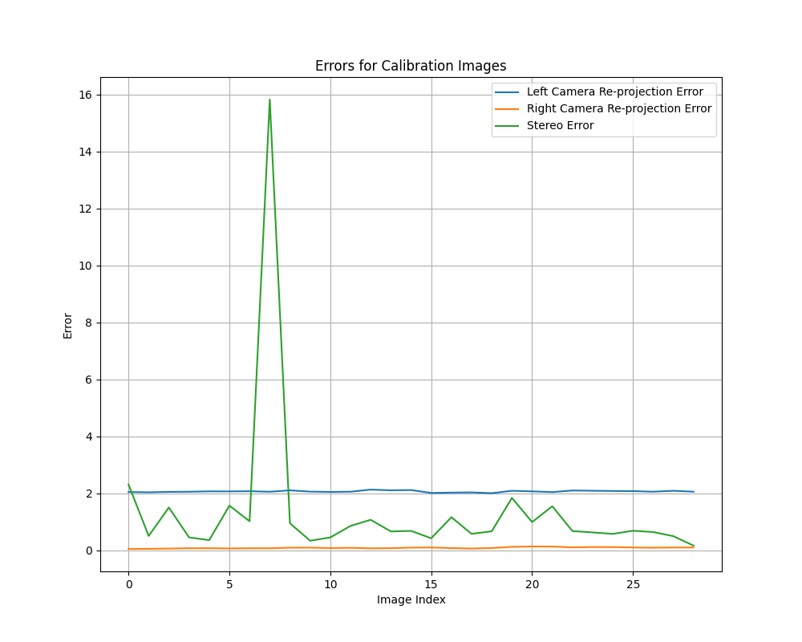

## Overview

The `StereoCalibrator` is a Python tool for stereo camera calibration. It processes stereo images to extract chessboard features and computes both camera and stereo calibration parameters. These parameters are essential for applications like 3D reconstruction, depth estimation, and stereo vision.

## Features

- Automatic detection of chessboard corners in stereo images.
- Computes intrinsic (camera matrix, distortion coefficients) and stereo parameters (rotation, translation, rectification, projection, and Q matrix).
- Visualizes camera calibration errors to assess quality.
- Detects and highlights outliers in calibration data for debugging.
- Saves calibration data to `stereoMap.xml`.
- Supports corner visualization with customizable markers for debugging.

## Quick Start

1. **Prepare Input Images**:
   - Capture chessboard images from the stereo camera system and organize them in directories:
     - `downloaded_images/left` (for left camera images)
     - `downloaded_images/right` (for right camera images).

2. **Run the Script**:
   ```python
   images_left = glob.glob("downloaded_images/left/*.jpg")
   images_right = glob.glob("downloaded_images/right/*.jpg")

   stereo_calibrator = StereoCalibrator(
       chessboard_size=(7, 10), 
       frame_size_h=1296,  # Image height 
       frame_size_w=2304,  # Image width 
       size_of_chessboard_squares_mm=23,
       debug=True  # Enable visualization if needed
   )
   stereo_calibrator.perform_calibration(images_left, images_right)
   stereo_calibrator.print_results()
   ```
   
3. **Visualization**:
   - The system plots and visualizes camera calibration errors (re-projection and stereo errors). Outliers, if any, are identified.
   - Example visualization of camera error plot:

   

4. **Results**:
   - Key outcomes, such as focal length, rotation, and translation, are printed to the console.
   - Calibration matrices and rectification data are saved in `stereoMap.xml`.

## Key Methods

- **`perform_calibration(images_left, images_right)`**: Executes the full stereo calibration workflow.
- **`save_rectified_images(images_left, images_right)`**: Executes the rectification including/excluding out of roi.
- **`save_matrices(camera_matrix_L, dist_L, camera_matrix_R, dist_R)`**: Saves calibration and rectification parameters to an XML file.
- **`measure_outlier()`**: Measures camera errors, visualizes calibration error plots, and highlights outliers.

## Parameters

- `chessboard_size`: A tuple specifying the number of inner corners per row and column (default: `(7, 10)`).
- `frame_size_h` and `frame_size_w`: Image resolution of the stereo camera system.
- `size_of_chessboard_squares_mm`: Real-world chessboard square size (default: `23mm`).
- Optional inputs:
  - `f_in_mm`: Focal length in millimeters (optional if unknown).
  - `pixel_size_mm`: Physical pixel size in millimeters (optional if unknown).
  - ** if both values are already known, it requires significantly less calibration images.
- `debug`: Set to `True` for visualizing the corners and error plots during calibration.

## Notes

- **Ensure the chessboard used matches the `chessboard_size` specified.**
- Enable the `debug` mode to save visualizations of chessboard corners for every calibration image.

## License

This project is open-source and free to use with proper attribution to the authors.